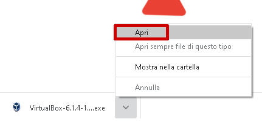
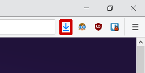
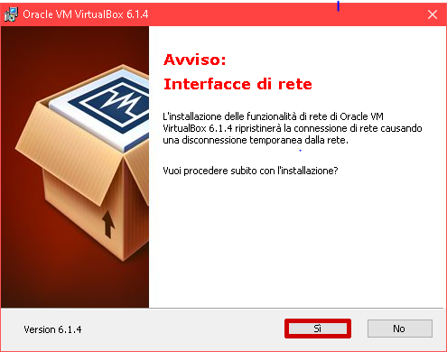
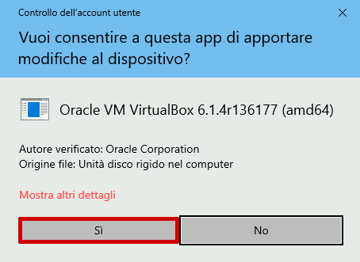
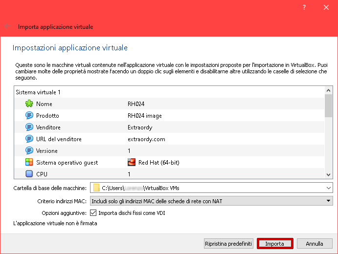
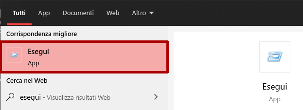
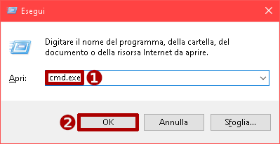

# Installazione VirtualBox Windows

La seguente procedura è stata testata su Windows 10 build 1909, ma dovrebbe essere valida per qualunque versione di Windows, con i dovuti accorgimenti.

#### Credenziali di accesso per la macchina virtuale

| nome utente | password | ruolo |
|-|-|-|
| student | student | utente normale |
| root | redhat | amministratore |

## 1. Download

- Scaricare la versione 6.1.4 di VirtualBox da [questo](https://download.virtualbox.org/virtualbox/6.1.4/VirtualBox-6.1.4-136177-Win.exe) link (si tratta del sito ufficiale *virtualbox.org*); a seconda del browser utilizzato, seguite le indicazioni relative:
    * ### Chrome:
        - All'apertura del link il download inizierà automaticamente, e il seguente indicatore verrà mostrato in basso a sinistra della finestra del browser

        

        - Al termine del download fate click sinistro sul bottone con la freccia verso il basso e selezionate "Apri"

        

    * ### Edge:
        - All'apertura del link il download NON inizierà automaticamente: cliccate sul bottone "Salva" che comparirà nella finestra di notifica in fondo a quella del browser

        

        - Al termine del download fate click sul bottone "Esegui" per avviare l'installazione

        

    * ### Firefox:
        - All'apertura del link il download NON inizierà automaticamente: cliccate sul bottone "Salva file" che comparirà nella finestra di dialogo chiamata "Apertura di VirtualBox-6.1.4-136177-Win.exe"

        

        - Al termine del download fate click sul bottone con la freccia verso il basso, che si trova in alto a destra del browser

        

        - Cliccate col tasto sinistro sul nome del file appena scaricato ("VirtualBox-6.1.4-136177-Win")

        

## 2. Installazione

**NOTA**: per l'installazione del programma VirtualBox sono necessari 500MB di spazio libero sul disco, oltre a 20 GB di spazio libero per importare ed utilizzare correttamente la macchina virtuale fornita per il corso.

- Avviare il file di installazione e seguire la procedura illustrata di seguito:
    * Cliccare "Avanti >" sulla schermata di benvenuto;

    

    * Cliccare "Avanti >" sulla prima schermata **Installazione personalizzata**;

    

    * Cliccare "Avanti >" sulla seconda schermata **Installazione personalizzata**;

    

    * Cliccare "Si" sulla schermata **Avviso: Interfacce di rete**;

    

    * Cliccare "Installa" sulla schermata **Pronto per l'installazione**

    

- Consentire al programma di effettuare modifiche al PC, per avviare la procedura di installazione (l'avviso di UAC di Windows comparirà dopo qualche secondo dal click sul bottone "Installa");

    

---
- Cliccare "Installa" sulla finestra **Installare questo software di dispositivo?** per quanto riguarda il software `Oracle Corporation Controller USB ...`;
---


- Cliccare "Fine" sulla schermata **L'installazione di Oracle VM Virtualbox 6.1.4 è completata**; il programma verrà avviato.

    

## 3. Importare la macchina virtuale

Il file che contiene tutto il necessario per utilizzare la macchina virtuale proposta (chiamato `RH024.ova`) è disponibile al seguente [link](https://drive.google.com/open?id=1OU2rsSPBxk4V6KamomSOX8PbqVETy--y); dopo aver cliccato il link, fate riferimento al [passo 1](#1-download) per quanto riguarda il download e l'apertura del file.

A questo [link](https://youtu.be/CY9y-l410AQ) si trova lo screencast che illustra i passaggi descritti di seguito.

- Una volta scaricato il file, apritelo in VirtualBox (se avete seguito la procedura di installazione proposta, basterà un doppio click):


- Cliccare su "Importa" nella finestra di riepilogo che apparirà:



- Attendere che l'importazione sia terminata, a questo punto la macchina virtuale sarà disponibile come una voce nell'elenco della finestra di VirtualBox:


### Problema DNS durante registrazione della sottoscrizione

Se la vostra macchina è collegata attraverso una rete VPN, potreste incontrare dei [problemi](https://github.com/extraordy/rh024/issues/8) DNS nella fase di registrazione del sistema con la sottoscrizione Red Hat Developer; in questo caso, potete provare ad effettuare le seguenti operazioni:

- Per prima cosa arrestate la macchina virtuale "RH024", se in esecuzione;

- Aprite il menù start, cercate l'applicazione "Esegui" e avviatela:



- Scrivete `cmd.exe` nella casella di testo e cliccate il bottone "Ok":



- Incollate il seguente comando nella finestra del temrmilane, e premete Invio:

```ps
"C:\Program Files\Oracle\VirtualBox\VBoxManage.exe" modifyvm RH024 --natdnshostresolver1 on
```


- Avviate la macchina virtuale RH024 e provate ad effettuare la registrazione, come descritto al [passo 4](../rhdev-subscribe/README.md/#4-attivazione-della-sottoscrizione) della guida alla sottoscrizione.
